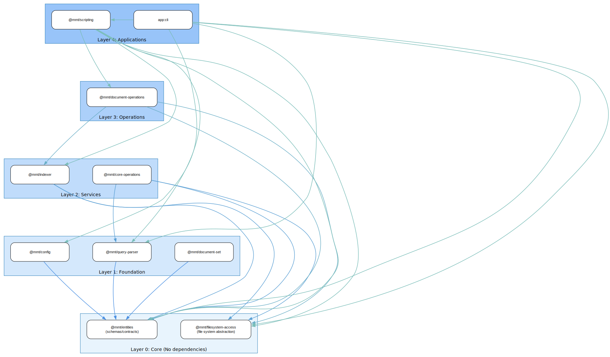

# Package Dependency Analysis

Generated: 2025-06-25T21:14:50.886Z

## 1. Package Dependency Summary

| Package | Depends On | Depended On By | Internal Files | Internal Deps |
|---------|------------|----------------|----------------|---------------|
| @mmt/entities | _none_ | @mmt/config, @mmt/core-operations, @mmt/document-operations, @mmt/indexer, @mmt/query-parser, @mmt/scripting, app:cli | 10 | 16 |
| @mmt/filesystem-access | _none_ | @mmt/core-operations, @mmt/document-operations, @mmt/indexer, @mmt/scripting, app:cli | 1 | 0 |
| @mmt/query-parser | @mmt/entities | @mmt/core-operations, @mmt/scripting, app:cli | 1 | 0 |
| @mmt/indexer | @mmt/entities, @mmt/filesystem-access | @mmt/document-operations, @mmt/scripting | 11 | 18 |
| @mmt/scripting | @mmt/document-operations, @mmt/entities, @mmt/filesystem-access, @mmt/indexer, @mmt/query-parser | app:cli | 7 | 13 |
| @mmt/document-operations | @mmt/entities, @mmt/filesystem-access, @mmt/indexer | @mmt/scripting | 7 | 15 |
| @mmt/config | @mmt/entities | app:cli | 2 | 1 |
| app:cli | @mmt/config, @mmt/entities, @mmt/filesystem-access, @mmt/query-parser, @mmt/scripting | _none_ | 8 | 10 |
| @mmt/core-operations | @mmt/entities, @mmt/filesystem-access, @mmt/query-parser | _none_ | 2 | 1 |
## 2. Architecture Analysis & Recommendations

### Issues Found

✅ No major architectural issues found.

### Dependency Metrics

| Package | Afferent Coupling | Efferent Coupling | Instability |
|---------|------------------|-------------------|-------------|
| @mmt/entities | 7 ▮▮▮▮▮▮▮ | 0 · | ✅ 0.00 |
| @mmt/filesystem-access | 5 ▮▮▮▮▮ | 0 · | ✅ 0.00 |
| @mmt/query-parser | 3 ▮▮▮ | 1 ▮ | 🟢 0.25 |
| @mmt/indexer | 2 ▮▮ | 2 ▮▮ | 🟡 0.50 |
| @mmt/scripting | 1 ▮ | 5 ▮▮▮▮▮ | 🔴 0.83 |
| @mmt/document-operations | 1 ▮ | 3 ▮▮▮ | 🔴 0.75 |
| @mmt/config | 1 ▮ | 1 ▮ | 🟡 0.50 |
| app:cli | 0 · | 5 ▮▮▮▮▮ | 🔴 1.00 |
| @mmt/core-operations | 0 · | 3 ▮▮▮ | 🔴 1.00 |

**Metrics Explanation:**
- **Afferent Coupling (Ca)**: Number of packages that depend on this package
- **Efferent Coupling (Ce)**: Number of packages this package depends on
- **Instability (I)**: Ce / (Ca + Ce) - ranges from 0 (stable) to 1 (unstable)
  - 0 = Maximally stable (many depend on it, it depends on nothing)
  - 1 = Maximally unstable (nothing depends on it, it depends on many)

### Suggested Package Layers

Based on the dependency analysis, here's the suggested layered architecture:

_[View full diagram](./package-layers.svg)_

#### Layer Descriptions:

- **Layer 0 (Core)**: No dependencies, used by all other layers
- **Layer 1 (Foundation)**: Basic services that depend only on core
- **Layer 2 (Services)**: Business logic services
- **Layer 3 (Operations)**: Complex operations that orchestrate services
- **Layer 4 (Applications)**: End-user applications
