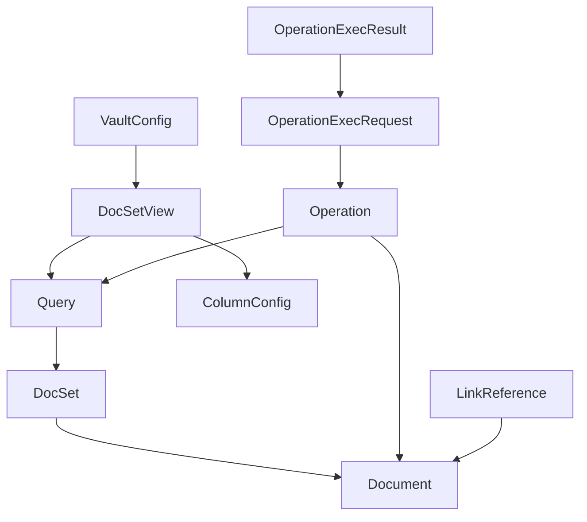

# MMT Data Entity Models

## Core Entities

### Document Entity
```typescript
// Represents a single markdown document
const DocumentSchema = z.object({
  // File system properties
  path: z.string(), // Absolute path to file
  relativePath: z.string(), // Path relative to vault root
  filename: z.string(),
  size: z.number(), // bytes
  created: z.date(),
  modified: z.date(),
  
  // Content properties
  preview: z.string().optional(), // First ~100 chars, loaded on demand
  
  // Parsed frontmatter (gray-matter compatible)
  frontmatter: z.record(
    z.union([
      z.string(),
      z.number(),
      z.boolean(),
      z.date(),
      z.array(z.any()), // Arrays of any type
      z.record(z.any()), // Nested objects
    ])
  ).default({}),
  
  // Derived properties
  properties: z.array(z.string()), // List of frontmatter keys
  hasIncompleteTasks: z.boolean().optional(),
  wordCount: z.number().optional(),
});

export type Document = z.infer<typeof DocumentSchema>;
```

### DocSet Entity
```typescript
// Represents a collection of documents
const DocSetSchema = z.object({
  id: z.string().uuid(),
  documents: z.array(DocumentSchema),
  totalCount: z.number(),
  query: QuerySchema.optional(), // The query that produced this set
  timestamp: z.date(),
});

export type DocSet = z.infer<typeof DocSetSchema>;
```

### Query Entity
```typescript
// Represents a parsed search query
const QueryConditionSchema = z.discriminatedUnion('type', [
  z.object({
    type: z.literal('text'),
    value: z.string(),
    operator: z.literal('contains'), // Future: 'exact', 'regex'
  }),
  z.object({
    type: z.literal('path'),
    value: z.string(),
    operator: z.enum(['exact', 'wildcard']),
  }),
  z.object({
    type: z.literal('date'),
    field: z.enum(['created', 'modified']),
    operator: z.enum(['before', 'after', 'between']),
    value: z.date(),
    value2: z.date().optional(), // For 'between'
  }),
  z.object({
    type: z.literal('property'),
    key: z.string(),
    operator: z.enum(['exists', 'equals', 'contains']),
    value: z.unknown().optional(),
  }),
  z.object({
    type: z.literal('size'),
    operator: z.enum(['gt', 'lt', 'between']),
    value: z.number(), // bytes
    value2: z.number().optional(),
  }),
]);

const QuerySchema = z.object({
  raw: z.string(), // Original query string
  conditions: z.array(QueryConditionSchema),
  logic: z.literal('AND'), // Future: support OR, complex grouping
});

export type Query = z.infer<typeof QuerySchema>;
export type QueryCondition = z.infer<typeof QueryConditionSchema>;
```

### DocSetView Entity
```typescript
// Represents a saved or active view configuration
const ColumnConfigSchema = z.object({
  id: z.string(),
  label: z.string(),
  width: z.number().optional(),
  visible: z.boolean().default(true),
  sortable: z.boolean().default(true),
});

const SortConfigSchema = z.object({
  columnId: z.string(),
  direction: z.enum(['asc', 'desc']),
});

const DocSetViewSchema = z.object({
  id: z.string().uuid(),
  name: z.string().optional(), // User-given name if saved
  query: QuerySchema,
  
  // Table configuration
  columns: z.array(ColumnConfigSchema),
  columnOrder: z.array(z.string()), // Column IDs in order
  sorting: z.array(SortConfigSchema),
  
  // Display options
  rowDensity: z.enum(['compact', 'standard', 'comfortable']).default('standard'),
  showPreview: z.boolean().default(true),
  
  // Metadata
  created: z.date(),
  lastUsed: z.date(),
  vaultPath: z.string(),
});

export type DocSetView = z.infer<typeof DocSetViewSchema>;
```

### Operation Entities
```typescript
// Base operation schema - just describes what to do
const OperationBaseSchema = z.object({
  id: z.string().uuid(),
  
  // Source of files
  source: z.discriminatedUnion('type', [
    z.object({
      type: z.literal('files'),
      files: z.array(z.string()), // File paths
    }),
    z.object({
      type: z.literal('query'),
      query: QuerySchema,
      files: z.array(z.string()), // Snapshot of matched files at creation time
    }),
  ]),
});

// Move operation
const MoveOperationSchema = OperationBaseSchema.extend({
  operation: z.literal('move'),
  target: z.object({
    folder: z.string(),
  }),
});

// Update properties operation
const UpdatePropertiesOperationSchema = OperationBaseSchema.extend({
  operation: z.literal('updateProperties'),
  updates: z.array(z.object({
    action: z.enum(['set', 'remove']),
    key: z.string(),
    value: z.unknown().optional(), // Only for 'set'
  })),
});

// Union of all operations
const OperationSchema = z.discriminatedUnion('operation', [
  MoveOperationSchema,
  UpdatePropertiesOperationSchema,
]);

export type Operation = z.infer<typeof OperationSchema>;
export type MoveOperation = z.infer<typeof MoveOperationSchema>;
export type UpdatePropertiesOperation = z.infer<typeof UpdatePropertiesOperationSchema>;
```

### Service Response Entities
```typescript
// QM Service response
const QMSearchResultSchema = z.object({
  documents: z.array(z.object({
    id: z.string(), // File path
    content: z.string(),
    metadata: z.record(z.unknown()),
    score: z.number().optional(),
  })),
  totalCount: z.number(),
  queryTime: z.number(), // milliseconds
});

export type QMSearchResult = z.infer<typeof QMSearchResultSchema>;
```

### Configuration Entities
```typescript
// Vault configuration
const VaultConfigSchema = z.object({
  vaultPath: z.string(), // Absolute path to vault root
  qmServiceUrl: z.string().url().optional(), // Optional - for vector similarity features
});

export type VaultConfig = z.infer<typeof VaultConfigSchema>;

// Link reference (for file-relocator package)
// Note: This schema will evolve during implementation
const LinkReferenceSchema = z.object({
  sourceFile: z.string(), // File containing the link
  targetFile: z.string(), // File being linked to  
  linkType: z.enum(['wikilink', 'markdown']),
  linkText: z.string(), // The actual link text
  position: z.object({
    line: z.number(),
    column: z.number(),
  }).optional(),
});

export type LinkReference = z.infer<typeof LinkReferenceSchema>;

// Operation execution request
const OperationExecRequestSchema = z.object({
  id: z.string().uuid(),
  operations: z.array(OperationSchema),
  timestamp: z.date(),
});

export type OperationExecRequest = z.infer<typeof OperationExecRequestSchema>;

// Operation execution result
const OperationExecResultSchema = z.object({
  requestId: z.string().uuid(),
  executedAt: z.date(),
  summary: z.object({
    total: z.number(),
    succeeded: z.number(),
    failed: z.number(),
  }),
  results: z.array(z.object({
    operationId: z.string(),
    file: z.string(),
    success: z.boolean(),
    error: z.string().optional(),
  })),
  snapshotPath: z.string().optional(), // Path to pre-operation backup for undo
});

export type OperationExecResult = z.infer<typeof OperationExecResultSchema>;
```

## Entity Relationships



## Next Steps

These entities form the contracts between packages. Each package will:
1. Import only the schemas it needs
2. Validate all inputs/outputs
3. Never bypass the schema validation
4. Use type inference for TypeScript types
