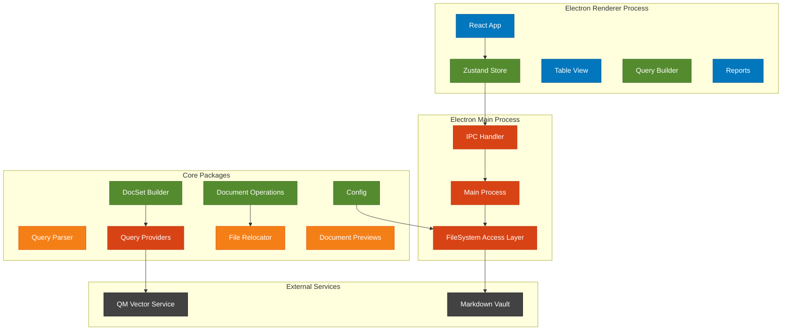
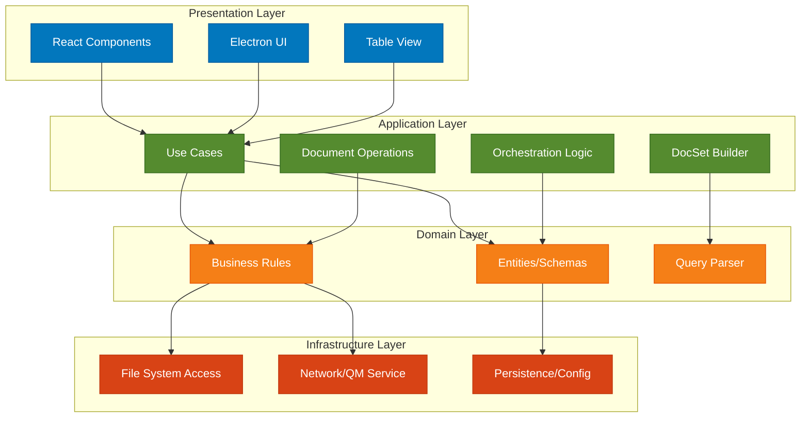
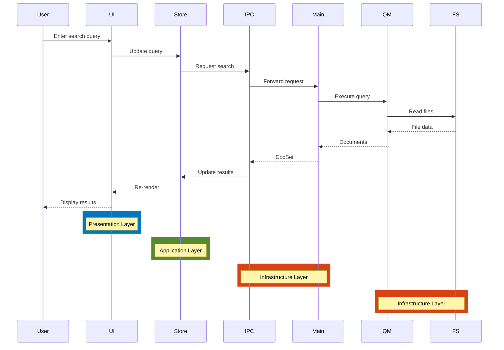
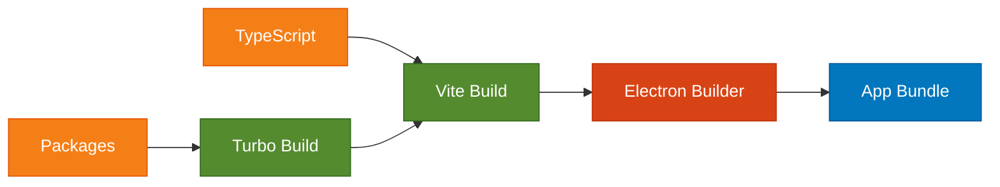

# MMT Technical Architecture

## System Architecture Overview



## Technology Stack

### Core Technologies
- **Runtime**: Electron 31.x with Node.js 20.x
- **UI Framework**: React 18 with TypeScript 5.5
- **Build Tool**: Vite with electron-vite
- **Package Management**: pnpm with Turborepo
- **Language**: TypeScript with strict mode

### Key Libraries
- **State Management**: Zustand 4.x
- **Data Table**: TanStack Table 8.x
- **Styling**: Tailwind CSS 3.x
- **Icons**: Heroicons 2.x
- **Schema Validation**: Zod 3.x
- **IPC Layer**: electron-trpc with @trpc/server
- **YAML Processing**: js-yaml 4.x
- **Markdown Parsing**: gray-matter 4.x
- **Testing**: Vitest + Playwright

## Architecture Patterns

### 1. Clean Architecture Layers



### 2. Data Flow Architecture



### 3. Operation Pattern with Snapshots

```typescript
// Operations are simple data objects
interface Operation {
  id: string
  operation: 'move' | 'updateProperties'
  source: {
    type: 'files' | 'query'
    files: string[]
  }
  // Operation-specific params
}

// Orchestrator handles execution and snapshots
class OperationOrchestrator {
  async execute(request: OperationExecRequest): Promise<OperationExecResult> {
    // Create snapshot before execution
    const snapshotPath = await this.createSnapshot(vaultPath)
    
    try {
      // Execute operations
      const results = await this.executeOperations(request.operations)
      
      return {
        requestId: request.id,
        executedAt: new Date(),
        snapshotPath,
        results,
        summary: this.calculateSummary(results)
      }
    } catch (error) {
      // Restore from snapshot on failure
      await this.restoreSnapshot(snapshotPath)
      throw error
    }
  }
  
  private async createSnapshot(vaultPath: string): Promise<string> {
    // Use hard links for fast snapshots
    const snapshotDir = `.snapshots/${Date.now()}`
    await exec(`cp -al "${vaultPath}" "${snapshotDir}"`)
    return snapshotDir
  }
}

/**
 * Enhanced snapshot strategy with operations log
 * 
 * Hard links (cp -al) provide fast snapshots but have limitations:
 * - Protect against file deletion/moves
 * - Don't protect against content changes (file truncation, overwrites)
 * 
 * For development safety, we add an optional operations log:
 */
interface OperationLogEntry {
  timestamp: Date
  operation: Operation
  filesModified: Array<{
    path: string
    originalContent: string  // Store full content or hash
    newContent?: string      // For debugging
  }>
}

class EnhancedOperationOrchestrator extends OperationOrchestrator {
  private enableOperationLog: boolean = process.env.NODE_ENV === 'development'
  
  async execute(request: OperationExecRequest): Promise<OperationExecResult> {
    const snapshotPath = await this.createSnapshot(request.vaultPath)
    const logEntry: OperationLogEntry = {
      timestamp: new Date(),
      operation: request.operation,
      filesModified: []
    }
    
    try {
      // For operations that modify content, capture original state
      if (this.enableOperationLog && this.modifiesContent(request.operation)) {
        for (const file of request.operation.files) {
          const content = await this.fs.readFile(file)
          logEntry.filesModified.push({
            path: file,
            originalContent: content
          })
        }
      }
      
      const results = await this.executeOperations(request.operations)
      
      // Log the operation for recovery
      if (this.enableOperationLog) {
        await this.writeOperationLog(logEntry)
      }
      
      return results
    } catch (error) {
      // Can restore from either snapshot or operation log
      await this.restoreFromSnapshot(snapshotPath)
      // Or: await this.restoreFromOperationLog(logEntry)
      throw error
    }
  }
  
  private async writeOperationLog(entry: OperationLogEntry): Promise<void> {
    const logPath = `.operations/logs/${entry.timestamp.toISOString()}.json`
    await this.fs.writeFile(logPath, JSON.stringify(entry, null, 2))
  }
}
```

## IPC Communication Design

### Type-Safe IPC with electron-trpc
```typescript
// packages/entities/src/ipc-router.ts
import { z } from 'zod'
import { router, procedure } from '@trpc/server'
import { 
  QuerySchema, 
  DocSetSchema, 
  OperationSchema,
  VaultConfigSchema 
} from './schemas'

export const ipcRouter = router({
  // File system operations
  fs: router({
    readFile: procedure
      .input(z.object({ path: z.string() }))
      .query(async ({ input, ctx }) => {
        return await ctx.fileSystem.readFile(input.path)
      }),
    
    writeFile: procedure
      .input(z.object({ 
        path: z.string(), 
        content: z.string() 
      }))
      .mutation(async ({ input, ctx }) => {
        await ctx.fileSystem.writeFile(input.path, input.content)
        return { success: true }
      }),
    
    moveFile: procedure
      .input(z.object({ 
        from: z.string(), 
        to: z.string() 
      }))
      .mutation(async ({ input, ctx }) => {
        await ctx.fileSystem.moveFile(input.from, input.to)
        return { success: true }
      })
  }),
  
  // High-level operations
  docSet: router({
    build: procedure
      .input(z.object({ 
        query: z.string(),
        options: z.object({
          vaultPath: z.string(),
          limit: z.number().optional()
        })
      }))
      .query(async ({ input, ctx }) => {
        return await ctx.docSetBuilder.build(input.query, input.options)
      })
  }),
  
  operations: router({
    execute: procedure
      .input(z.object({ 
        operations: z.array(OperationSchema) 
      }))
      .mutation(async ({ input, ctx }) => {
        return await ctx.operationOrchestrator.execute({
          id: crypto.randomUUID(),
          operations: input.operations,
          timestamp: new Date()
        })
      })
  }),
  
  config: router({
    load: procedure
      .query(async ({ ctx }) => {
        return await ctx.configService.load()
      }),
    
    save: procedure
      .input(VaultConfigSchema)
      .mutation(async ({ input, ctx }) => {
        await ctx.configService.save(input)
        return { success: true }
      })
  })
})

export type IpcRouter = typeof ipcRouter

// In renderer - fully typed!
const content = await trpc.fs.readFile.query({ path: '/file.md' })
const docSet = await trpc.docSet.build.query({ 
  query: 'modified:>2024-01-01',
  options: { vaultPath: '/vault', limit: 500 }
})
```

## State Management Architecture

### Global State Structure
```typescript
interface AppState {
  // Configuration
  config: VaultConfig | null
  
  // Current view
  activeView: DocSetView | null
  savedViews: DocSetView[]
  
  // Current data
  currentDocSet: DocSet | null
  selectedDocuments: Set<string>
  documentPreviews: Map<string, string> // Lazy-loaded previews
  
  // Operations
  pendingOperations: Operation[]
  lastOperationResult: OperationExecResult | null
  
  // Provider state
  activeProvider: 'qm' | 'filesystem'
  providerStatus: {
    qm: { available: boolean; lastError?: string }
    filesystem: { available: boolean }
  }
  
  // UI State
  searchQuery: string
  isLoading: boolean
  error: string | null
  rowLimit: number // 500
  
  // Actions
  loadConfig: () => Promise<void>
  executeQuery: (query: string) => Promise<void>
  saveView: (name?: string) => Promise<void>
  queueOperation: (op: Operation) => void
  executeOperations: () => Promise<void>
  loadPreview: (docPath: string) => Promise<void>
  exportCSV: (columns: string[]) => Promise<void>
}
```

### State Persistence
- DocSetView → YAML files in app data
- Last active view → Store reference in electron-store
- Operation history → `.operations/` in vault

## Performance Optimizations

### 1. Row Limiting
```typescript
// Limit display to 500 rows with clear messaging
const displayDocuments = documents.slice(0, 500)
const hasMore = documents.length > 500

{hasMore && (
  <div className="text-warning">
    Showing first 500 of {documents.length} results. 
    Refine your filters to see all results.
  </div>
)}
```

### 2. Memoization Strategy
```typescript
// Memoize expensive computations
const sortedDocuments = useMemo(
  () => sortDocuments(documents, sorting),
  [documents, sorting]
)

// Memoize row components
const Row = memo(({ document }) => {
  // Row implementation
})
```

### 3. Lazy Loading
- Load document previews only when preview column is visible
- Batch preview requests for visible rows
- Cache loaded previews in state

### 4. Batch Operations
```typescript
// Batch file operations for efficiency
const batchSize = 50
for (let i = 0; i < operations.length; i += batchSize) {
  const batch = operations.slice(i, i + batchSize)
  await processBatch(batch)
  // Update progress
  onProgress(i + batch.length, operations.length)
}
```

## Security Considerations

### 1. Context Isolation
```typescript
// Preload script with electron-trpc
import { exposeElectronTRPC } from 'electron-trpc/preload'

process.once('loaded', () => {
  exposeElectronTRPC()
})

// Main process setup
import { createIPCHandler } from 'electron-trpc/main'
import { ipcRouter } from '@mmt/entities'

createTRPCHandler({
  router: ipcRouter,
  windows: [mainWindow],
  createContext: async () => ({
    fileSystem: fileSystemAccess,
    docSetBuilder,
    operationOrchestrator,
    configService
  })
})
```

### 2. Path Validation
```typescript
// Validate all file paths
function isPathInVault(inputPath: string, vaultPath: string): boolean {
  const resolved = path.resolve(inputPath)
  return resolved.startsWith(vaultPath) && !resolved.includes('..')
}
```

### 3. Input Sanitization
- Validate all user inputs with Zod
- Sanitize file paths
- Escape special characters in queries

## Error Handling Strategy

### 1. Error Boundaries
```typescript
class ErrorBoundary extends Component {
  componentDidCatch(error: Error) {
    logger.error('UI Error:', error)
    this.setState({ hasError: true })
  }
}
```

### 2. Graceful Degradation
- QM service down → Fall back to filesystem
- Invalid query → Show helpful error
- File not found → Skip and continue

### 3. User Feedback
```typescript
interface ErrorDisplay {
  level: 'error' | 'warning' | 'info'
  message: string
  action?: {
    label: string
    handler: () => void
  }
}
```

## Development Architecture

### 1. Monorepo Structure
```
mmt/
├── apps/
│   ├── electron/      # Main process
│   └── renderer/      # React app
├── packages/
│   ├── entities/          # Shared types
│   ├── filesystem-access/ # Centralized fs operations
│   ├── config/           # Configuration management
│   ├── query-parser/     # Query parsing
│   ├── query-providers/  # Query execution
│   ├── document-operations/ # File operations
│   ├── file-relocator/   # Link integrity
│   ├── document-previews/ # Preview generation
│   ├── docset-builder/   # DocSet orchestration
│   ├── view-persistence/ # View save/load
│   ├── table-view/       # React table component
│   └── reports/          # Export functionality
├── turbo.json        # Build orchestration
└── pnpm-workspace.yaml
```

### 2. Build Pipeline


### 3. Development Workflow
1. `pnpm dev` - Start dev servers
2. Hot reload for renderer process
3. Auto-restart for main process changes
4. Integrated debugging in WebStorm

## Deployment Architecture

### 1. Build Outputs
```
dist/
├── mac/
│   └── MMT.app
├── operations/        # Operation templates
└── views/            # Default views
```

### 2. Distribution Strategy
- Direct download from GitHub releases
- macOS code signing for security
- No auto-update in MVP

### 3. Configuration
```typescript
// Vault configuration - ALL fields required, no defaults
interface VaultConfig {
  vaultPath: string              // Must be absolute path that exists
  providers: ('qm' | 'filesystem')[] // Order determines fallback
  qmServiceUrl?: string          // Required if 'qm' is in providers array
}

// App startup
const configPath = args['--config']
if (!configPath) {
  console.error('Error: --config flag is required')
  process.exit(1)
}

const config = await configService.load(configPath)
// ConfigService will validate and exit on any errors
```

## Future Architecture Considerations

### 1. Multi-Vault Support
- Vault switcher UI
- Cross-vault search
- Vault-specific settings

### 2. Advanced Features
- LLM integration for bulk processing
- Visual thumbnails for documents
- Advanced export formats (PDF, etc.)

## Architecture Decision Records (ADRs)

### ADR-001: Use Electron for Desktop App
**Status**: Accepted
**Context**: Need cross-platform desktop app with file system access
**Decision**: Use Electron for its maturity and ecosystem
**Consequences**: Larger bundle size but full Node.js capabilities

### ADR-002: Zod for Schema Validation
**Status**: Accepted
**Context**: Need runtime type safety across package boundaries
**Decision**: Use Zod for its TypeScript integration and runtime validation
**Consequences**: Type inference and validation in one tool

### ADR-003: TanStack Table for Data Grid
**Status**: Accepted
**Context**: Need flexible, performant table with sorting/filtering
**Decision**: Use TanStack Table for its headless approach
**Consequences**: More setup but complete control over UI

### ADR-004: YAML for Configuration
**Status**: Accepted
**Context**: Need human-readable, editable configuration format
**Decision**: Use YAML for views and operations
**Consequences**: Easy debugging and manual editing

### ADR-005: No Mocks Testing Strategy
**Status**: Accepted
**Context**: Need reliable testing that reflects real behavior
**Decision**: Use real implementations only, no mocks or test doubles
**Consequences**: Integration tests over unit tests, more realistic testing

### ADR-006: Centralized FileSystem Access
**Status**: Accepted
**Context**: Need single IPC boundary and future portability
**Decision**: All file operations through filesystem-access package
**Consequences**: Easier to port to cloud/mobile, simpler IPC

### ADR-007: electron-trpc for IPC
**Status**: Accepted
**Context**: Need type-safe IPC without manual channel management
**Decision**: Use electron-trpc with our existing Zod schemas
**Consequences**: Type-safe IPC, automatic validation, less boilerplate

### ADR-008: Explicit Configuration Only
**Status**: Accepted
**Context**: Configuration ambiguity leads to debugging difficulties and unexpected behavior
**Decision**: Require explicit config file path at startup, no defaults, no fallbacks, no env vars
**Consequences**: 
- Completely deterministic configuration
- Clear error messages for missing/invalid config
- Easier debugging and support
- Must specify --config flag on every run

### ADR-009: Local Indexing with Optional QM
**Status**: Accepted
**Context**: Need to start development without external service dependencies
**Decision**: Build local indexer based on Dataview patterns, make QM optional for vector search
**Consequences**:
- Can develop and ship MVP without QM
- Reuse proven indexing patterns from Dataview
- Add vector similarity as progressive enhancement
- Simpler development and deployment
